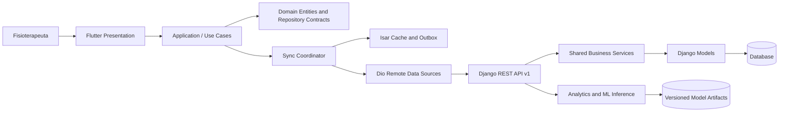
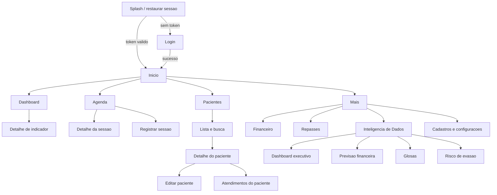
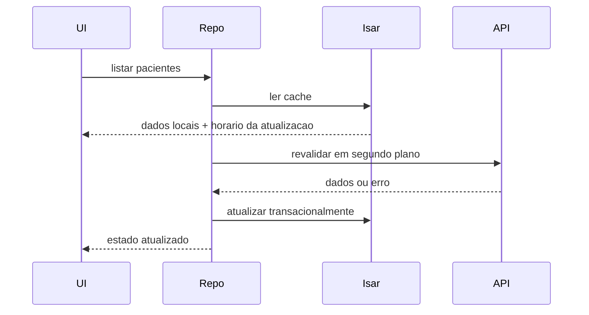

# PhysioManage Mobile - Arquitetura e Plano de Execucao

## 1. Resumo executivo

O PhysioManage Mobile sera um cliente Flutter para Android, preparado para iOS, voltado a fisioterapeutas autonomos em atendimento domiciliar. O aplicativo preservara a identidade visual do sistema web e organizara suas funcionalidades em modulos independentes, usando Clean Architecture, Riverpod e navegacao declarativa.

### Decisoes principais

| Tema | Decisao |
|---|---|
| Framework | Flutter, canal stable |
| Estado e injecao | Riverpod com geracao de codigo |
| Navegacao | `go_router` com protecao de rotas |
| HTTP | `dio`, interceptors e cancelamento de requisicoes |
| Modelos/DTOs | `freezed` e `json_serializable` |
| Persistencia local | Isar para cache e fila offline |
| Segredos | `flutter_secure_storage` para tokens |
| Graficos | `fl_chart` |
| Conectividade | `connectivity_plus` como sinal auxiliar, nunca como prova de acesso a internet |
| Observabilidade | logs sem dados clinicos e relatorio de falhas sanitizado |
| Backend de referencia | Django como fonte unica da verdade |

## 2. Diagnostico do backend atual

Na versao analisada, a premissa "o backend ja possui APIs prontas" nao corresponde ao repositorio:

- nao ha Django REST Framework, serializers ou rotas JSON;
- nao ha JWT nem refresh token;
- as rotas atuais renderizam HTML e usam sessao/cookie e CSRF;
- a base esta configurada somente com SQLite;
- nao existem dados de custo de deslocamento, repasse ou glosa;
- nao ha historico suficiente definido para treinar e avaliar modelos preditivos.

Portanto, o aplicativo nao consegue consumir exclusivamente os endpoints existentes porque esses endpoints ainda nao existem. A entrega deve comecar por um **Sprint 0 de habilitacao da API**. Isso adiciona uma interface REST sobre os mesmos models e regras atuais; nao substitui as views web e nao altera regras de negocio.

### Regra de compatibilidade

As views web continuam funcionando. A API deve reutilizar services/selectors compartilhados e sempre filtrar dados pelo `Fisioterapeuta` autenticado. Nenhum identificador enviado pelo cliente pode substituir esse filtro de propriedade.

## 3. Arquitetura completa



### Camadas Flutter

**Presentation**

- pages, widgets, tema, navegacao e acessibilidade;
- `AsyncNotifier`/providers transformam estados de dominio em estados de tela;
- nenhuma chamada HTTP ou regra de negocio dentro de widgets.

**Application**

- casos de uso como `Login`, `ListarPacientes`, `RegistrarSessao` e `SincronizarPendencias`;
- coordena repositorios, validacao e politicas de cache;
- estados explicitos: inicial, carregando, dados, vazio, offline e erro.

**Domain**

- entidades imutaveis e contratos de repositorio;
- tipos de falha independentes de Dio, Isar ou Flutter;
- regras que pertencem ao cliente, sem duplicar regras autoritativas do Django.

**Data**

- DTOs, mappers, data sources remoto/local e implementacoes dos repositorios;
- o DTO acompanha o contrato JSON; a entidade acompanha o dominio;
- erros de infraestrutura sao convertidos para falhas conhecidas.

### Monorepo recomendado

```text
PI3/
|-- config/                         # Django existente
|-- core/                           # Dominio web existente
|-- api/                            # API REST v1 (Sprint 0)
|   |-- urls.py
|   |-- serializers/
|   |-- views/
|   |-- permissions.py
|   `-- tests/
|-- analytics/                      # Features, treino e inferencia de ML
|   |-- datasets/
|   |-- features/
|   |-- training/
|   |-- inference/
|   `-- tests/
|-- mobile/                         # Aplicativo Flutter
|-- docs/
`-- manage.py
```

## 4. Estrutura de pastas Flutter

```text
mobile/
|-- android/
|-- ios/
|-- assets/
|   |-- fonts/
|   |-- icons/
|   `-- images/
|-- integration_test/
|-- test/
|-- lib/
|   |-- app/
|   |   |-- app.dart
|   |   |-- bootstrap.dart
|   |   |-- router.dart
|   |   `-- theme/
|   |-- core/
|   |   |-- config/
|   |   |-- errors/
|   |   |-- network/
|   |   |-- security/
|   |   |-- storage/
|   |   |-- sync/
|   |   `-- widgets/
|   |-- features/
|   |   |-- auth/
|   |   |-- dashboard/
|   |   |-- pacientes/
|   |   |-- atendimentos/
|   |   |-- sessoes/
|   |   |-- agenda/
|   |   |-- financeiro/
|   |   |-- repasses/
|   |   `-- inteligencia_dados/
|   |       |-- dashboard_executivo/
|   |       |-- previsao_financeira/
|   |       |-- glosas/
|   |       `-- rotatividade/
|   `-- main.dart
|-- pubspec.yaml
`-- analysis_options.yaml
```

Cada feature repete somente o necessario:

```text
feature/
|-- presentation/
|   |-- controllers/
|   |-- pages/
|   `-- widgets/
|-- application/
|   `-- use_cases/
|-- domain/
|   |-- entities/
|   `-- repositories/
`-- data/
    |-- data_sources/
    |-- dtos/
    |-- mappers/
    `-- repositories/
```

## 5. Fluxograma das telas



### Navegacao principal

A barra inferior tera quatro destinos para uso com uma mao: **Inicio**, **Agenda**, **Pacientes** e **Mais**. A acao contextual de registrar sessao fica ao alcance do polegar nas telas de agenda e atendimento. Financeiro e Inteligencia de Dados ficam em `Mais` para nao sobrecarregar a navegacao primaria.

## 6. Wireframes conceituais

### Dashboard

```text
+----------------------------------+
| PhysioManage            [perfil] |
| Bom dia, Ana                     |
|----------------------------------|
| Receita no mes       R$ 8.420,00 |
| +7,2% vs. mes anterior     [↗]   |
|----------------------------------|
| [12 hoje] [38 ativos] [2 alertas]|
|----------------------------------|
| Proxima sessao                   |
| 14:30  Maria S. | Vila Mariana   |
|                  [Ver rota]      |
|----------------------------------|
| Agenda de hoje                   |
| 15:40 Joao P.       [Registrar]  |
| 17:00 Lucia M.      [Detalhes]   |
|----------------------------------|
| Inicio Agenda Pacientes   Mais   |
+----------------------------------+
```

### Paciente

```text
+----------------------------------+
| [<] Maria Silva            [⋮]   |
| Ativa | Empresa Vida              |
|----------------------------------|
| [Ligar] [Mensagem] [Rota]        |
|----------------------------------|
| Proximo atendimento              |
| Hoje, 14:30 | Fisioterapia motora|
|----------------------------------|
| Quadro clinico                   |
| Resumo com expansao controlada   |
|----------------------------------|
| Frequencia  3/sem | Evasao  Baixo|
|----------------------------------|
| Historico de sessoes             |
| 28 ago  Compareceu      R$ 120   |
+----------------------------------+
```

### Inteligencia de Dados

```text
+----------------------------------+
| [<] Inteligencia de Dados        |
| [Mes] [Trimestre] [Ano]          |
|----------------------------------|
| Receita prevista                 |
| R$ 9.180  +9,0%       confianca  |
| [grafico com faixa de incerteza] |
|----------------------------------|
| Riscos que pedem atencao         |
| 3 pacientes | 2 glosas provaveis |
|----------------------------------|
| [Financeiro] [Glosas] [Evasao]   |
|----------------------------------|
| Dados insuficientes devem ser    |
| mostrados sem inventar previsoes.|
+----------------------------------+
```

## 7. Sistema visual e UX

### Tokens derivados do sistema web

| Token | Claro | Escuro | Uso |
|---|---|---|---|
| Primary | `#0C7A9B` | `#56BCD6` | acoes e selecao |
| Primary strong | `#0D5F79` | `#8BD4E5` | titulos e destaques |
| Secondary | `#F2A54A` | `#FFBD70` | financeiro e atencao |
| Text | `#173344` | `#EAF4F7` | texto principal |
| Muted | `#4A7387` | `#AAC3CE` | texto secundario |
| Border | `#D0E4ED` | `#31515F` | divisores |
| Surface | `#FFFFFF` | `#102A35` | superficies |
| Background | `#F0F6FB` | `#081C24` | fundo |

- Tipografia: Segoe UI quando licenciada/disponivel; caso contrario, uma fonte metrically compatible empacotada e definida no tema.
- Componentes mobile usam Material 3 customizado, sem reproduzir Bootstrap literalmente.
- Areas tocaveis terao no minimo 48 x 48 dp e contraste WCAG AA.
- Cards terao raio maximo de 8 dp; listas e secoes serao preferidas para conteudo operacional denso.
- Graficos nunca dependerao apenas de cor; terao rotulos, legenda e resumo textual.
- Tema escuro sera semanticamente equivalente, nao mera inversao.
- Skeletons serao usados apenas quando preservarem o layout; operacoes destrutivas exigem confirmacao.

## 8. Modelagem funcional

### Modulos existentes

| Modulo | Entidades | Casos de uso principais |
|---|---|---|
| Autenticacao | Usuario, Fisioterapeuta | login, refresh, logout, restaurar sessao |
| Pacientes | Paciente, Empresa | listar, buscar, detalhar, cadastrar, editar, excluir |
| Atendimentos | Atendimento, TipoAtendimento | listar, criar, editar, ativar/desativar, excluir |
| Sessoes/Agenda | Sessao, Atendimento | agenda por periodo, registrar, bater ponto, editar, cancelar |
| Financeiro | Sessao, Empresa, TipoAtendimento | totais por periodo, empresa e tipo |
| Relatorios | Sessao | filtrar e exportar PDF |

### Dados ausentes para o PI4

Sem estes dados, parte dos indicadores seria apenas estimativa sem rastreabilidade:

| Entidade proposta | Campos minimos | Motivo |
|---|---|---|
| Deslocamento | sessao, distancia_km, custo, origem, destino | custo e lucro liquido |
| Repasse | sessao/empresa, valor_bruto, descontos, valor_liquido, status, vencimento, pagamento | acompanhamento de repasses |
| Glosa | repasse/sessao, operadora, valor, motivo, status, datas | historico, taxa e predicao |
| EventoPaciente | paciente, tipo, ocorrido_em, origem | sinais temporais de evasao |
| Predicao | tipo, alvo, versao_modelo, score, explicacao, calculado_em | auditoria e reproducibilidade |

Essas adicoes ampliam o dominio, mas nao devem mudar o comportamento dos models atuais. Precisam de migracoes, validacoes, API e testes proprios aprovados pelo responsavel de negocio.

### Definicoes dos indicadores

- **Receita realizada:** soma de `valor_sessao` no periodo. Deve ser decidido se faltas cobradas entram no calculo.
- **Lucro liquido estimado:** receita realizada menos deslocamentos, glosas confirmadas e outros custos cadastrados.
- **Cancelamento:** sessao com `compareceu = false` nao distingue falta, cancelamento e reagendamento. Criar um status explicito antes de publicar esse KPI.
- **Paciente ativo:** hoje e inferido de atendimentos; definir oficialmente se basta existir `Atendimento.ativo`.
- **Taxa de glosa:** valor glosado dividido pelo valor apresentado, segmentado por operadora e periodo.
- **Risco de evasao:** probabilidade calibrada em horizonte definido, por exemplo, ausencia de nova sessao por 30 dias.

## 9. Estrategia de integracao com Django

### Contrato REST minimo (`/api/v1`)

| Metodo e rota | Finalidade |
|---|---|
| `POST /auth/token/` | emitir access e refresh token |
| `POST /auth/token/refresh/` | renovar access token |
| `POST /auth/logout/` | invalidar refresh token |
| `GET /me/` | perfil autenticado |
| `GET,POST /pacientes/` | listar/criar pacientes |
| `GET,PATCH,DELETE /pacientes/{id}/` | detalhe/manutencao |
| `GET,POST /empresas/` | empresas |
| `GET,POST /tipos-atendimento/` | tipos |
| `GET,POST /atendimentos/` | atendimentos |
| `GET,PATCH,DELETE /atendimentos/{id}/` | detalhe/manutencao |
| `GET,POST /sessoes/` | agenda e sessoes, com filtro de periodo |
| `POST /atendimentos/{id}/bater-ponto/` | registro rapido idempotente |
| `GET /dashboard/` | KPIs e proximas sessoes |
| `GET /financeiro/resumo/` | totais agregados por periodo |
| `GET /inteligencia/*` | inferencias e series consolidadas |

Todos os endpoints de colecao devem oferecer paginacao, ordenacao, filtros documentados e timestamps em ISO 8601 com timezone. Valores monetarios devem trafegar como strings decimais, nunca como `double` binario.

### Envelope de erro

```json
{
  "code": "validation_error",
  "message": "Revise os campos informados.",
  "fields": {
    "email": ["Informe um e-mail valido."]
  },
  "correlation_id": "01J..."
}
```

O cliente converte respostas em falhas de dominio: `unauthorized`, `forbidden`, `validation`, `notFound`, `conflict`, `rateLimited`, `offline`, `timeout`, `server` e `unknown`. Mensagens internas e stack traces nunca chegam ao usuario.

### JWT e sessao

- access token curto, recomendado entre 5 e 15 minutos;
- refresh token rotativo, com blacklist no logout e deteccao de reutilizacao;
- refresh fica no armazenamento seguro; access preferencialmente em memoria;
- um interceptor anexa o access token;
- ao receber `401`, uma unica renovacao e executada e requisicoes concorrentes aguardam o resultado;
- se a renovacao falhar, cache sensivel e credenciais sao removidos e o usuario volta ao login;
- HTTPS e obrigatorio em homologacao/producao.

### Cache e offline



- Leitura: estrategia stale-while-revalidate.
- Escrita offline: outbox com UUID, payload, versao local, tentativas e estado.
- Sincronizacao: ao abrir o app, retomar conectividade, fazer pull-to-refresh ou executar tarefa permitida pelo SO.
- Conflitos: usar `updated_at`/ETag e `If-Match`; nunca aplicar silenciosamente last-write-wins em dado clinico.
- Exclusoes: tombstones ate confirmacao do servidor.
- Primeira versao offline: leitura de agenda/pacientes e registro de sessao pendente. Edicoes complexas podem exigir conexao.
- Isar nao deve guardar refresh token. Dados clinicos em cache exigem minimizacao, logout com limpeza e avaliacao de criptografia em repouso.

## 10. Machine Learning e Inteligencia de Dados

### Principio de entrega

Comecar com analise descritiva e baselines estatisticos. ML so entra em producao quando houver volume, qualidade, consentimento/base legal, metrica de referencia e validacao temporal. A interface deve mostrar faixa de incerteza, data da ultima atualizacao e fatores principais; nao deve apresentar previsoes como certezas.

### Estrutura dos modulos

```text
analytics/
|-- datasets/          # extracao versionada e validacao de esquema
|-- features/          # features sem vazamento temporal
|-- training/          # pipelines, validacao temporal e tuning
|-- evaluation/        # metricas, calibracao, vies e relatorios
|-- registry/          # metadados e versao de artefatos
|-- inference/         # servicos chamados pela API
`-- monitoring/        # drift, qualidade e desempenho
```

### Casos de uso e baselines

| Caso | Baseline inicial | Evolucao possivel | Metricas |
|---|---|---|---|
| Receita prevista | media movel sazonal | Prophet, ARIMA ou gradient boosting com lags | MAE, MAPE e cobertura do intervalo |
| Glosa | taxa historica por operadora/motivo | regressao logistica ou boosting calibrado | PR-AUC, recall no top-k, Brier score |
| Evasao | regras de recencia e faltas | classificacao com janela temporal | PR-AUC, recall, calibracao |
| Cancelamento | taxa movel por paciente/faixa horaria | classificacao supervisionada | PR-AUC e custo esperado |

### Features candidatas

- Financeiro: receita por semana/mes, sessoes agendadas, pacientes ativos, sazonalidade e valores contratados.
- Glosa: operadora, tipo, valor, motivo historico, atraso documental e taxa recente.
- Evasao: recencia, frequencia, faltas consecutivas, tendencia de sessoes, duracao do tratamento e mudancas de agenda.

CPF, telefone, nome, endereco e texto clinico livre devem ser excluidos por padrao. O modelo nao deve recomendar conduta clinica. O score serve para priorizacao administrativa e sempre permite revisao humana.

### Ciclo de vida

1. Definir rotulo e horizonte com o orientador e usuarios.
2. Criar dicionario de dados e testes de qualidade.
3. Gerar snapshot temporal anonimizado/pseudonimizado.
4. Separar treino/validacao/teste por tempo, evitando vazamento do futuro.
5. Comparar baseline e modelo candidato.
6. Calibrar probabilidades e definir limiar pelo custo de falso positivo/negativo.
7. Registrar versao, features, metricas e periodo dos dados.
8. Servir inferencia em lote; evitar inferencia no dispositivo na primeira versao.
9. Monitorar drift, calibracao e utilidade das intervencoes.

## 11. Roadmap de desenvolvimento

Estimativa academica para uma equipe pequena, ajustavel ao calendario do PI4:

| Fase | Semanas | Resultado verificavel |
|---|---:|---|
| Descoberta e contrato | 1-2 | escopo, jornadas, definicoes de KPI e OpenAPI aprovados |
| Sprint 0 - API | 3-4 | DRF/JWT, isolamento por usuario e endpoints essenciais testados |
| Fundacao Flutter | 5 | tema, router, CI, flavors, HTTP, storage e login |
| Operacao principal | 6-8 | pacientes, atendimentos, agenda e sessoes |
| Financeiro e offline | 9-10 | resumo financeiro, cache e outbox de sessao |
| Inteligencia descritiva | 11 | dashboard executivo com dados reais e qualidade sinalizada |
| Baselines preditivos | 12-13 | previsao/riscos avaliados offline e documentados |
| Hardening | 14 | acessibilidade, seguranca, desempenho e testes E2E |
| Piloto e publicacao | 15-16 | beta fechado, correcoes e AAB na Play Console |

### Gates de qualidade

- API nao avanca sem teste de isolamento entre fisioterapeutas.
- Offline nao avanca sem teste de conflito e idempotencia.
- ML nao avanca sem superar ou justificar o baseline em teste temporal.
- Release nao avanca com segredo no app, HTTP sem TLS, crash bloqueante ou fluxo critico sem teste.

## 12. Backlog priorizado

### P0 - Obrigatorio para MVP

| ID | Item | Criterio de aceite resumido |
|---|---|---|
| P0-01 | Especificar OpenAPI v1 | contratos e erros revisados pelo web e mobile |
| P0-02 | Implementar DRF e JWT | login, refresh, logout e throttling testados |
| P0-03 | Garantir isolamento multiusuario | acesso cruzado retorna 404/403 em todos os recursos |
| P0-04 | Criar fundacao Flutter | flavors, Riverpod, router, Dio, tema e CI funcionais |
| P0-05 | Implementar login seguro | restauracao, expiracao e logout completo |
| P0-06 | Pacientes | lista, busca, detalhe, cadastro e edicao |
| P0-07 | Atendimentos | lista, detalhe, cadastro e edicao |
| P0-08 | Agenda e sessoes | filtro por dia, registro e bater ponto idempotente |
| P0-09 | Dashboard operacional | KPIs atuais e proximas sessoes |
| P0-10 | Cache essencial | agenda/pacientes legiveis sem rede e estado visivel |
| P0-11 | Qualidade e LGPD | acessibilidade, privacidade, logs sanitizados e testes criticos |

### P1 - Entrega PI4

| ID | Item | Criterio de aceite resumido |
|---|---|---|
| P1-01 | Financeiro mobile | totais por periodo, empresa e tipo consistentes com o web |
| P1-02 | Modelar deslocamentos | custo auditavel associado a sessoes |
| P1-03 | Modelar repasses e glosas | historico e status com trilha temporal |
| P1-04 | Dashboard executivo | graficos acessiveis e definicoes de KPI visiveis |
| P1-05 | Previsao financeira baseline | intervalo de previsao e metricas documentados |
| P1-06 | Risco de glosa | score calibrado ou mensagem de dados insuficientes |
| P1-07 | Risco de evasao | ranking explicavel, sem recomendacao clinica automatica |
| P1-08 | Fila offline de sessao | retry, idempotencia e conflito testados |
| P1-09 | Modo escuro | paridade funcional e contraste AA |

### P2 - Evolucao

| ID | Item | Criterio de aceite resumido |
|---|---|---|
| P2-01 | Roteirizacao | abrir app de mapas e ordenar visitas com consentimento |
| P2-02 | Notificacoes | lembretes configuraveis sem expor dado clinico na tela bloqueada |
| P2-03 | Biometria | desbloqueio local com fallback seguro |
| P2-04 | Exportacao e compartilhamento | PDF protegido e fluxo consciente de privacidade |
| P2-05 | Preparacao iOS | ajustes de plataforma e pipeline sem alterar dominio |

## 13. Plano de testes

### Piramide e escopo

| Nivel | Flutter | Django/ML |
|---|---|---|
| Unitario | entities, mappers, use cases, controllers e sync | services, selectors, serializers, features e metricas |
| Componente | widgets, temas, estados vazio/erro/offline | views API, permissions, filtros e paginacao |
| Contrato | DTO contra OpenAPI e fixtures versionadas | schema OpenAPI e compatibilidade retroativa |
| Integracao | repositorio remoto/local, refresh concorrente e Isar | API + banco, JWT, idempotencia e jobs de inferencia |
| E2E | login, paciente, sessao, offline e logout | jornada completa em ambiente de homologacao |

### Casos obrigatorios

- usuario A nunca le, altera ou exclui recurso do usuario B;
- refresh simultaneo gera apenas uma tentativa e preserva requisicoes aguardando;
- logout e expiracao removem tokens e cache sensivel;
- registro repetido com a mesma chave de idempotencia nao duplica sessao;
- horario de verao/timezone nao desloca sessoes;
- valores monetarios mantem precisao decimal;
- operacao offline aparece como pendente e sincroniza ao recuperar rede;
- conflito de edicao pede decisao, sem sobrescrever dado clinico;
- graficos funcionam com leitor de tela, fonte ampliada e sem depender de cor;
- telas criticas atendem aparelhos compactos e tablets sem sobreposicao;
- previsoes exibem estado de dados insuficientes;
- pipeline de ML impede vazamento temporal e compara com baseline congelado.

### Metas nao funcionais

- primeira renderizacao util monitorada em aparelho Android intermediario;
- listas paginadas mantem rolagem fluida;
- APK/AAB nao contem URL secreta, credencial ou chave privada;
- API aplica throttling, validacao, HTTPS, cabecalhos seguros e auditoria adequada;
- cobertura e qualidade sao gates de CI, sem perseguir percentual isolado como substituto de bons cenarios.

## 14. Estrategia de publicacao Android

1. Criar application ID definitivo, por exemplo `br.edu.univesp.physiomanage`.
2. Definir flavors `dev`, `staging` e `prod`, cada um com URL publica HTTPS propria.
3. Configurar assinatura com upload key fora do Git e Play App Signing.
4. Gerar icone, splash, nome, versao semantica e `versionCode` incremental.
5. Limitar permissoes; localizacao e notificacao so entram quando a funcionalidade justificar.
6. Executar `flutter analyze`, testes, build release e varredura de segredos no CI.
7. Publicar AAB primeiro em teste interno, depois fechado com fisioterapeutas piloto.
8. Coletar falhas e metricas tecnicas sem CPF, nome, endereco ou quadro clinico.
9. Preparar ficha da loja, politica de privacidade, Data Safety e fluxo de exclusao de conta/dados.
10. Fazer rollout gradual em producao com plano de rollback por versao da API/feature flag.

Nao usar certificado autoassinado, cleartext HTTP ou banco local de desenvolvimento em builds distribuidos. O backend de producao deve usar banco suportado para concorrencia, backup e recuperacao; essa decisao precisa ser validada antes do piloto.

## 15. Melhorias futuras

- rotas de visita otimizadas com abertura no provedor de mapas escolhido pelo usuario;
- notificacoes de agenda e pendencias com conteudo discreto;
- biometria para desbloqueio local, sem substituir autenticacao do servidor;
- anexos/documentos com upload resiliente e controle de acesso;
- assinatura do paciente com analise juridica e trilha de auditoria;
- feature flags e configuracao remota para liberar modelos gradualmente;
- federacao de identidade, quando houver necessidade institucional;
- painel de qualidade dos dados e explicabilidade para o orientador/administrador;
- suporte iOS usando as mesmas camadas de dominio e dados;
- avaliacao de inferencia on-device apenas se privacidade, latencia ou operacao offline justificarem.

## 16. Riscos e mitigacoes

| Risco | Impacto | Mitigacao |
|---|---|---|
| API inexistente | bloqueia todo o mobile | Sprint 0 e OpenAPI antes das telas de dominio |
| KPIs sem definicao | numeros inconsistentes | glossario aprovado e testes de paridade |
| Dados insuficientes para ML | previsoes enganosas | baseline, estado "dados insuficientes" e entrega descritiva primeiro |
| Dados clinicos no dispositivo | impacto LGPD | minimizacao, secure storage, limpeza e threat modeling |
| Conflitos offline | perda de informacao | versionamento, idempotencia e resolucao explicita |
| Escopo amplo para PI4 | atraso | P0/P1, gates e demonstracao vertical antecipada |
| SQLite em producao | concorrencia e operacao | validar migracao para banco gerenciado antes do piloto |

## 17. Definition of Done

Uma historia so esta concluida quando possui criterio de aceite demonstrado, testes adequados ao risco, estados de carregamento/vazio/erro/offline, acessibilidade verificada, telemetria sem dados sensiveis, contrato documentado e revisao de seguranca quando tratar autenticacao ou dado pessoal.

## 18. Proximas decisoes do projeto

Antes da implementacao, equipe e orientador devem aprovar:

1. se a API REST sera adicionada a este Django ou fornecida por outro repositorio; Será adicionada a esse Django
2. definicoes oficiais de receita, lucro, cancelamento, paciente ativo, glosa e evasao;
3. quais novos dados podem ser coletados e sua base legal/LGPD;
4. horizonte das previsoes e custo de erros de classificacao;
5. ambiente de hospedagem, banco de producao e estrategia de backup;
6. escopo do MVP demonstravel dentro do calendario do PI4.